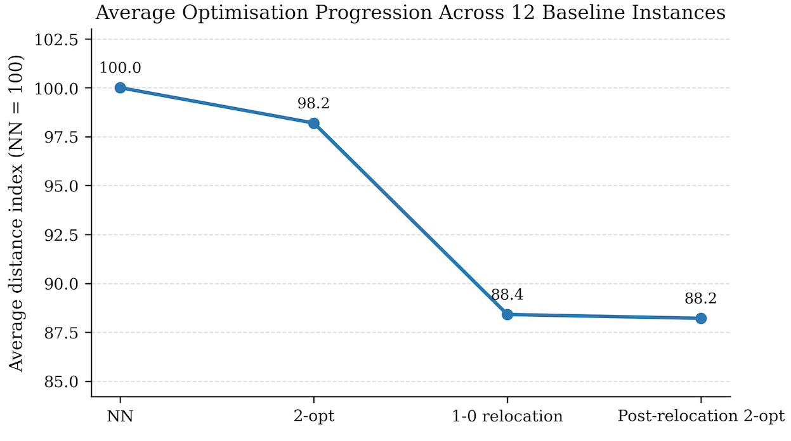
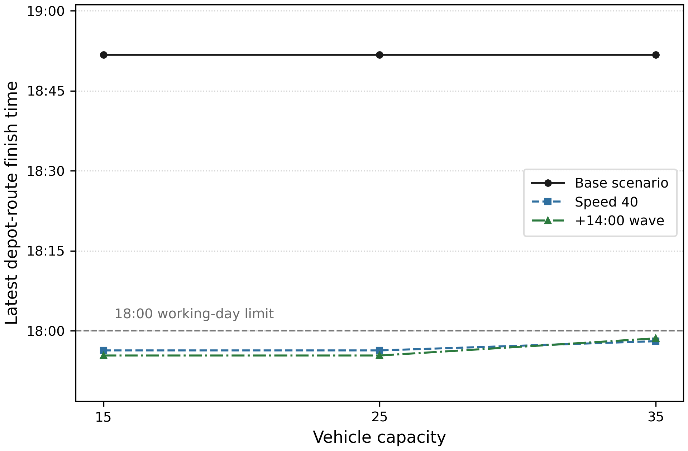

# VRP-LNS Framework

**A Python-based routing optimisation framework integrating constructive heuristics, local search, alternative fulfilment structures, Large Neighbourhood Search, and operational timing constraints.**

## Overview

This repository contains a modular routing optimisation framework developed as part of a Master's thesis in Mobility and Supply Chain Engineering at KU Leuven. The framework investigates routing problems involving suppliers, depots, and customers, with particular emphasis on how routing quality and operational feasibility interact as progressively richer operational constraints are introduced.

The computational framework develops from constructive routing and local-search improvement to alternative customer-construction strategies and supplier--customer fulfilment structures. Large Neighbourhood Search (LNS) is subsequently introduced using multiple destroy--repair operator combinations and simulated annealing acceptance to further improve routing quality.

The framework then extends beyond distance-based optimisation by incorporating depot-side operational timing. Supplier arrivals, goods availability, depot dispatch timing, dispatch-wave scheduling, and feasibility-repair procedures are used to evaluate whether distance-efficient routing solutions remain operationally feasible under timing constraints. Sensitivity experiments further examine how changes in operational assumptions affect the resulting feasibility.

Finally, Time-Aware LNS integrates routing optimisation with these operational requirements. Candidate routing improvements are evaluated subject to the relevant timing-feasibility conditions, allowing additional routing improvements to be investigated while preserving the operational feasibility established by the timing framework.

## Framework at a Glance

The project follows a progressive experimental structure:

```text
Constructive Routing
        ↓
Local-Search Improvement
        ↓
Customer Construction and Clustering
        ↓
Alternative Supplier--Customer Fulfilment Structures
        ↓
Large Neighbourhood Search
        ↓
Operational Depot Timing
        ↓
Feasibility Repair
        ↓
Dispatch-Wave Scheduling
        ↓
Operational Sensitivity Analysis
        ↓
Time-Aware Large Neighbourhood Search
```

The resulting framework therefore progresses from routing construction and distance optimisation toward the joint consideration of **routing quality and operational feasibility**.

## Methods and Technical Components

The framework combines routing heuristics, neighbourhood search, metaheuristic optimisation, and operational feasibility modelling within a common experimental structure.

### Routing Construction and Local Search

- **Nearest-Neighbour construction** for generating initial capacitated routing solutions.
- **2-opt local search** for intra-route improvement.
- **1-0 relocation** for moving customers between routes while maintaining feasibility.
- **Sweep and KMeans-based customer construction** for investigating how customer grouping influences subsequent routing behaviour.

### Routing and Fulfilment Structures

Three alternative supplier--customer fulfilment structures are evaluated:

- **Supplier--Depot--Customer:** supplier flows are consolidated through the depot before customer delivery.
- **Direct Supplier--Customer:** customer demand is served directly from the corresponding supplier structure.
- **Hybrid:** combines depot-based and direct fulfilment within the routing framework.

These structures allow routing performance to be examined under different ways of organising supplier, depot, and customer interactions.

### Large Neighbourhood Search

The framework extends the locally improved solutions using **Large Neighbourhood Search (LNS)** with simulated annealing acceptance.

Multiple destroy and repair strategies are implemented and evaluated, including:

- random removal;
- worst removal;
- route removal;
- related / Shaw removal;
- greedy insertion; and
- Regret-2 insertion.

The modular operator structure allows different destroy--repair combinations to be evaluated under common experimental settings.

### Operational Timing and Feasibility

The routing framework is subsequently extended with depot-side operational constraints, including:

- supplier arrival and goods-availability timing;
- depot dispatch timing;
- dispatch-wave scheduling;
- route-level timing-feasibility checks;
- split-repair procedures for infeasible routing solutions; and
- sensitivity analysis under alternative operational assumptions.

This stage evaluates whether solutions that are efficient in terms of routing distance remain executable once operational timing requirements are introduced.

### Feasibility-Aware Optimisation

The final stage introduces **Time-Aware LNS**, in which candidate routing improvements must satisfy the relevant operational timing requirements before they can be accepted by the search procedure.

This allows routing quality to be further improved **within an operationally feasible solution space**, rather than treating distance optimisation and operational feasibility as separate problems.

## Key Findings

The experimental results show how routing performance and operational feasibility evolve as additional optimisation and timing components are introduced into the framework.

### Progressive Routing Improvement

Starting from Nearest-Neighbour construction, successive application of 2-opt, 1-0 relocation, and a final 2-opt pass produced an average **12.24% reduction in routing distance** across the baseline experimental settings. The results demonstrate that substantial improvements can already be obtained through relatively simple, sequential neighbourhood-search mechanisms before introducing a metaheuristic layer.



*Figure 1. Average routing-distance progression across the 12 baseline instances, indexed relative to the Nearest-Neighbour solution (NN = 100).*

### Additional Improvement through Large Neighbourhood Search

Large Neighbourhood Search provided further improvements beyond the locally optimised solutions. Across the matched operator experiments, the strongest destroy--repair combinations achieved approximately **4--5.5% additional improvement**, with Random Removal + Regret-2 Insertion and Related (Shaw) Removal + Regret-2 Insertion remaining among the strongest strategies when evaluated on larger Hybrid instances containing up to 200 customers.

These results indicate that neighbourhood destruction and reconstruction can uncover improvements that remain inaccessible to the preceding local-search procedures, while also showing that operator effectiveness varies across experimental settings rather than being dominated by a single strategy.

### Operational Feasibility under Timing Constraints

Introducing depot-side timing requirements showed that routing quality alone is not sufficient to guarantee operational feasibility. Solutions that were feasible from a routing and capacity perspective could become infeasible once supplier arrivals, goods availability, depot processing, dispatch timing, and the working-day limit were considered.

Targeted split-repair procedures recovered timing feasibility for the affected fixed-timing cases, while the subsequent dispatch-wave and sensitivity experiments demonstrated that the remaining boundary cases were sensitive to the operational environment rather than representing an inherent limitation of the underlying routing framework.



*Figure 2. Latest depot-route completion times for the 200-customer instances under the base configuration and two alternative operational scenarios. The 18:00 line represents the working-day feasibility limit.*

### Optimisation while Preserving Operational Feasibility

The final Time-Aware LNS experiments demonstrate that routing optimisation remains effective after operational feasibility has been established. Across the validated timing environments, the retained operator pairs achieved approximately **4--6% average additional reduction in total system distance**, while all evaluated customer--capacity settings remained operationally feasible.

Several individual instance--operator combinations achieved improvements exceeding **10%**, indicating that the remaining optimisation potential varies across problem instances even though the average gains are more moderate. Overall, the results demonstrate that operational feasibility and routing optimisation need not be competing objectives: additional routing improvements can be obtained while explicitly preserving the timing requirements of the operational framework.
